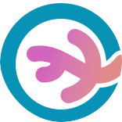

<br/>
<p align="center">
  <a href="https://github.com/salem404/coral-companion">
    
  </a>

  <h1 align="center">Coral Companion</h1>

  <p align="center">
    Coral Island companion web app
    <br/>
    <br/>
    <a href="https://coral-companion.netlify.app/"><strong>Live site »</strong></a>
    <br/>
    <br/>
    
    
  </p>
</p>

## Table of Contents

- [Table of Contents](#table-of-contents)
- [Features](#features)
- [Documentation](#documentation)
- [Run Locally](#run-locally)
- [Resources](#resources)
- [Tech Stack](#tech-stack)
- [License](#license)

## Features

- Account creation and login
- Different profiles for each account
- Character and item seasonal overview
- Todo list
- Dark mode

## Documentation

[API-Documentation](https://salem404.github.io/coral-companion)

## Run Locally

Make sure Docker is installed and running

Clone the project

```bash
  git clone https://github.com/salem404/coral-companion
```

Install dependencies in the project directory

```bash
  npm install && composer install
```

Create environment file

```bash
  cp .env.example .env
```

Start the server in the project directory

```bash
  vendor/bin/sail up
```

Create laravel application key

```bash
  vendor/bin/sail artisan key:generate
```

Create the database and seed it with data

```bash
  vendor/bin/sail artisan migrate --seed
```

## Resources

| Resource                 | Name            | Author                                             | Source                                         | License                                     |
| :----------------------- | :-------------- | :------------------------------------------------- | :--------------------------------------------- | :------------------------------------------ |
| Application logo         | logo.svg        | [Paula Rumeu](https://github.com/salem404)         | Own creation                                   | [![CC BY-SA 4.0][cc-by-sa-image]][cc-by-sa] |
| Application logo         | logo-color.svg  | [Paula Rumeu](https://github.com/salem404)         | Own creation                                   | [![CC BY-SA 4.0][cc-by-sa-image]][cc-by-sa] |
| Background waves         | wave1.svg       | [Paula Rumeu](https://github.com/salem404)         | Own creation                                   | [![CC BY-SA 4.0][cc-by-sa-image]][cc-by-sa] |
| Background waves         | wave2.svg       | [Paula Rumeu](https://github.com/salem404)         | Own creation                                   | [![CC BY-SA 4.0][cc-by-sa-image]][cc-by-sa] |
| Background foam          | foam.svg        | [Paula Rumeu](https://github.com/salem404)         | Own creation                                   | [![CC BY-SA 4.0][cc-by-sa-image]][cc-by-sa] |
| Background foam          | foam2.svg       | [Paula Rumeu](https://github.com/salem404)         | Own creation                                   | [![CC BY-SA 4.0][cc-by-sa-image]][cc-by-sa] |
| Gnome                    | gnome.svg       | [Paula Rumeu](https://github.com/salem404)         | Own creation                                   | [![CC BY-SA 4.0][cc-by-sa-image]][cc-by-sa] |
| Gnome                    | gnome0.svg      | [Paula Rumeu](https://github.com/salem404)         | Own creation                                   | [![CC BY-SA 4.0][cc-by-sa-image]][cc-by-sa] |
| Gnome                    | gnome1.svg      | [Paula Rumeu](https://github.com/salem404)         | Own creation                                   | [![CC BY-SA 4.0][cc-by-sa-image]][cc-by-sa] |
| Gnome                    | gnome2.svg      | [Paula Rumeu](https://github.com/salem404)         | Own creation                                   | [![CC BY-SA 4.0][cc-by-sa-image]][cc-by-sa] |
| Character and Item icons |                 | [Stairway Games](https://www.stairwaygames.com)    | [Coral Island Wiki](https://coralisland.wiki/) | [![CC BY-SA 4.0][cc-by-sa-image]][cc-by-sa] |
| Sign Out Icon            | si_Sign_out.svg | [Abhimanyu Rana](https://github.com/planetabhi)    | [SargamIcons](https://sargamicons.com)         | [![CC BY 4.0][cc-by-image]][cc-by]          |
| Sun Icon                 | si_Sun.svg      | [Abhimanyu Rana](https://github.com/planetabhi)    | [SargamIcons](https://sargamicons.com)         | [![CC BY 4.0][cc-by-image]][cc-by]          |
| Swap Icon                | si_Swap_horiz   | [Abhimanyu Rana](https://github.com/planetabhi)    | [SargamIcons](https://sargamicons.com)         | [![CC BY 4.0][cc-by-image]][cc-by]          |
| Moon Icon                | moon.svg        | [Abhimanyu Rana](https://github.com/planetabhi)    | [SargamIcons](https://sargamicons.com)         | [![CC BY 4.0][cc-by-image]][cc-by]          |
| Alert Icon               |                 | [Abhimanyu Rana](https://github.com/planetabhi)    | [SargamIcons](https://sargamicons.com)         | [![CC BY 4.0][cc-by-image]][cc-by]          |
| Check Icon               |                 | [Abhimanyu Rana](https://github.com/planetabhi)    | [SargamIcons](https://sargamicons.com)         | [![CC BY 4.0][cc-by-image]][cc-by]          |
| Trash icon               |                 | [Mikhail Kolomietc](https://www.figma.com/@demiko) | [Figma](https://www.figma.com)                 | [![CC BY 4.0][cc-by-image]][cc-by]          |
| Edit icon                |                 | [Mikhail Kolomietc](https://www.figma.com/@demiko) | [Figma](https://www.figma.com)                 | [![CC BY 4.0][cc-by-image]][cc-by]          |
| OpenEye icon             |                 | [Mikhail Kolomietc](https://www.figma.com/@demiko) | [Figma](https://www.figma.com)                 | [![CC BY 4.0][cc-by-image]][cc-by]          |
| ClosedEye icon           |                 | [Mikhail Kolomietc](https://www.figma.com/@demiko) | [Figma](https://www.figma.com)                 | [![CC BY 4.0][cc-by-image]][cc-by]          |
| GitHub Icon              | GitHubIcon.svg  | Github                                             | [GitHub](https://github.com)                   | [![CC BY 4.0][cc-by-image]][cc-by]          |

## Tech Stack

**Version Control:**


**Design:**


**Deployment:**


**Client:**


**Server:**


**Testing:**


**Linting:**


**Documentation:**


## License

This work is licensed under a
[Creative Commons Attribution-ShareAlike 4.0 International License][cc-by-sa].

[![CC BY-SA 4.0][cc-by-sa-image]][cc-by-sa]

[cc-by-sa]: http://creativecommons.org/licenses/by-sa/4.0/
[cc-by-sa-image]: https://licensebuttons.net/l/by-sa/4.0/88x31.png
[cc-by]: https://creativecommons.org/licenses/by/4.0/
[cc-by-image]: https://licensebuttons.net/l/by/4.0/88x31.png
